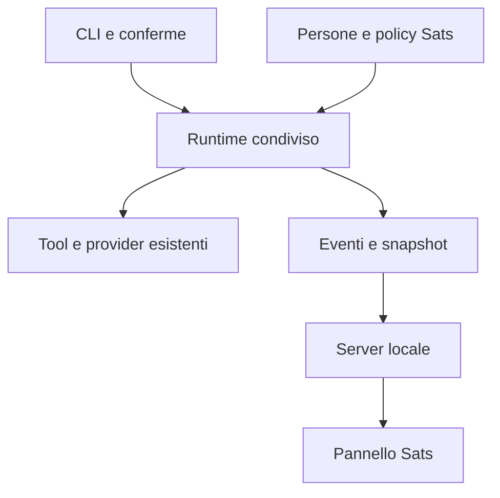

# Sats per Bitcode — Piano di implementazione

**Versione proposta:** 1.0 · **Data:** 1 ottobre 2026 · **Stato:** specifica di progetto, codice applicativo da implementare.

**Base verificata:** repository `bc1edi/bitcode`, commit `e79a7073d8fb7533928ecb7ebb6d2ef2c0b6f5da`. Prima di sviluppare, confrontare questo commit con la nuova HEAD e aggiornare i punti di intervento se sono cambiati.

## 1. Risultato da costruire

I **Sats** sono i quattro volti dei subagenti di Bitcode: **Node, Script, Hash e Merkle**. Ogni personaggio identifica una competenza e rende leggibile lo stato reale di una delega. La mascotte accompagna l'attività; il registro delle operazioni e le conferme restano espliciti.

Prima release: quattro personaggi integrati nei subagenti CLI, eventi di esecuzione condivisi e **pannello locale di osservazione** avviato con `bitcode --sats`. Si continuano a scrivere richieste e ad approvare azioni nel terminale. Il browser mostra mascotte, stati, operazioni essenziali e risultati di stato. Il pannello non avvia task e non approva tool.

Release successiva, separata: composer e conferme nel browser, riutilizzando lo stesso runtime. Questa distinzione permette di consegnare subito un'esperienza animata utile senza duplicare sessioni, esecuzione e autorizzazioni.

### Decisioni vincolanti

1. Conservare la famiglia attuale: piccoli bot morbidi, antropomorfi, visiera scura, occhi espressivi, braccia e piedini. I dettagli Bitcoin sono accessori discreti.
2. Inserire i personaggi nel design esistente di Bitcode: crema, Ink caldo, hairline, arancione per azioni e marchio. I colori delle mascotte identificano i personaggi, senza diventare quattro nuovi colori dei pulsanti.
3. Un solo runtime Node ESM; nessun framework o servizio esterno necessario per il pannello.
4. Le animazioni dipendono dagli eventi del runtime. Nessuna finta percentuale di avanzamento e nessuna animazione che annunci successo prima dell'esito.
5. Nessun avvio automatico dei quattro agenti insieme. Deleghe mirate, una alla volta nella prima release.
6. I quattro Sats non ricevono tool di firma, pagamento o broadcast. Il Bitcode principale mantiene il proprio flusso Bitcoin.
7. I permessi sono applicati dal codice. Il testo della persona e la grafica non costituiscono una sandbox.

## 2. Cosa esiste e cosa manca

| Elemento | Stato verificato | Conseguenza per l'implementazione |
|---|---|---|
| Runtime | CLI Node ESM, Node ≥22; dipendenze crittografiche già presenti | Aggiungere il pannello con `node:http`, HTML, CSS e JS locali |
| Interfaccia web | Gli HTML nel design system sono proposte visive con dati dimostrativi | Creare una UI collegata al runtime; quei mockup non provano l'esistenza di API, monitoring o chat web |
| Subagenti | `src/agents.mjs` legge solo `~/.bitcode/agents/*.md` | Aggiungere quattro persone distribuite nel repository e fusione con quelle dell'utente |
| Markdown | `loadMarkdownDir()` restituisce `name`, `description`, `body` | Avatar, colore e policy vanno in un registro separato; il frontmatter attuale non li carica |
| Delega automatica | `subagentTool()` chiama `runAgent()` con `hooks: {}` e tool senza `subagent` | Collegare eventi e approvazioni interne al runtime condiviso |
| Delega manuale | `/subagent` usa `ctx.tools` e `buildHooks()` senza `approve` | Unificare la delega, evitare ricorsione e mantenere lo stesso controllo dei tool |
| Hook di tool | `onToolStart` viene chiamato prima dell'approvazione | Non interpretarlo come esecuzione effettiva; introdurre un evento distinto per l'inizio reale |
| Esiti | I risultati sono stringhe; la CLI riconosce errori con `startsWith("ERROR")` | Aggiungere metadati tipizzati per denied/error/ok senza cambiare il testo dato al modello |
| Sessioni | I messaggi del parent vengono salvati; il child restituisce il testo finale | Conservare questo comportamento; le animazioni non vanno nei messaggi del modello |
| Trasporto HTTP | `src/http.mjs` è un client per richieste verso altri servizi | Il server del pannello sarà un modulo nuovo, separato |
| Asset attuali | 4 PNG trasparenti 1254×1254; GIF 512/640, 80 frame, 20 fps, loop 4 s | Riutilizzare i PNG come master e ottimizzare le copie per UI |
| Espressioni | Le GIF attuali oscillano il corpo; il volto resta quello del PNG | Produrre pose/espressioni dedicate prima di dichiarare animazioni emotive complete |
| Bitcoin / Lightning | Tool concreti già presenti; RGB non è integrato | I dettagli RGB sono visivi; nessuna capacità RGB nuova viene implicata. Taproot Assets e RGB non sono la stessa integrazione |

## 3. Identità e capacità dei quattro Sats

| ID stabile | Nome visualizzato | Ruolo | Carattere | Segno Bitcoin discreto | Colore personaggio |
|---|---|---|---|---|---|
| `node` | Node | Ricerca e contesto | Curioso, attento, testa leggermente inclinata | Piccola antenna Lightning arancione | Blu `#3297ff` |
| `script` | Script | Implementazione | Energico, giocoso, gesto di lavoro | Ricamo `<>` e tre piccoli accenti RGB | Arancione `#f7931a` |
| `hash` | Hash | Analisi di sicurezza | Calmo, concentrato, presenza stabile | Piccolo scudo/serratura laterale | Lime `#b6f500` |
| `merkle` | Merkle | Revisione | Riflessivo, preciso, cenno di conferma | Antenna biforcata, due nodi | Viola `#c96bff` |

I nomi del registro, dei file, degli asset e dei parametri del tool sono minuscoli. I titoli delle card sono in maiuscola iniziale. Il marchio principale resta **⚡ bitcode**; il nome di famiglia è **sats · by bitcode**.

### Persona e policy sono due cose distinte

Distribuire `agents/node.md`, `agents/script.md`, `agents/hash.md`, `agents/merkle.md`. Il frontmatter contiene soltanto la descrizione già supportata. Il corpo descrive competenza, comportamento e formato di risposta; niente istruzioni che annullino le linee guida Bitcoin del parent.

| Sat | Contratto della risposta | Policy applicata dal runner |
|---|---|---|
| Node | Riscontri, file/fonti consultati, incertezze, prossimo passo | Lettura del repository e interrogazioni ammesse; nessuna scrittura |
| Script | File cambiati, comportamento ottenuto, verifiche eseguite, limiti | Lettura, scrittura, modifica e shell con la normale approvazione |
| Hash | Problemi con gravità motivata, posizione, scenario verificabile e rimedio | Lettura e analisi; nessun comando shell o modifica |
| Merkle | Revisione rispetto alla richiesta, regressioni, verifiche mancanti, esito | Lettura e analisi; nessuna modifica |

**Allowlist iniziali, esatte:**

- Node: `read_file`, `list_dir`, `btc_fees`, `btc_mempool`, `btc_tx`, `btc_address`, `btc_block`, `liquid_fees`, `liquid_mempool`, `liquid_tx`, `liquid_address`, `liquid_block`, `liquid_asset`, `ln_decode_invoice`, `ln_info`, `ln_balance`, `ln_channels`, `taproot_asset_balance`.
- Script: `read_file`, `list_dir`, `write_file`, `edit_file`, `bash`, `ln_decode_invoice`.
- Hash e Merkle: `read_file`, `list_dir`, `ln_decode_invoice`.

La lista effettiva è l'intersezione fra l'allowlist e i tool realmente disponibili nella configurazione. I tool Lightning opzionali non appaiono senza un nodo configurato. Nessuno dei quattro riceve `subagent`, `bitcoin_rpc`, `wallet_create`, `wallet_send`, `btc_broadcast`, `ln_invoice_create`, `ln_invoice_pay`, `taproot_asset_send` o tool wallet.

Usare una allowlist esplicita, non solo `!tool.mutating`: oggi `ln_invoice_create` è marcato non mutating pur creando una invoice. I nuovi tool futuri non entrano automaticamente nelle policy.

La shell di Script resta un comando eseguito sulla macchina dell'utente: l'allowlist non impedisce a un comando approvato di richiamare altri programmi o servizi. Questa release non introduce isolamento OS. Hash e Merkle non diventano verificatori crittografici o certificazioni di sicurezza in virtù del nome.

### Personalizzazione e compatibilità

`loadAgents()` unisce prima le persone distribuite e poi quelle dell'utente, seguendo il modello di `loadCommands()`. Una persona omonima dell'utente sostituisce descrizione e corpo. Per i quattro ID Sats, immagine e policy rimangono quelle del registro: cambiare un Markdown non allarga i permessi. Le persone personalizzate con altri nomi rimangono utilizzabili, con avatar neutro ⚡ e la policy generica già prevista dal progetto.

La delega manuale e quella del tool passano entrambe per `runSubagent()`. Una delega approvata avvia il child; le mutazioni interne richiedono la stessa callback di approvazione del parent. **È una modifica intenzionale rispetto al comportamento attuale:** niente autoapprovazione implicita per aver approvato il solo tool `subagent`. Gli avvii espliciti `-p` e `--yolo` mantengono la semantica documentata. Aggiornare help e README insieme al codice.

## 4. Direzione visiva e asset

### Token da riutilizzare

| Uso | Valore verificato nel design system |
|---|---|
| Canvas | `#f7f7f4` |
| Canvas soft | `#fafaf7` |
| Card | `#ffffff` |
| Ink | `#26251e` |
| Body | `#5a5852` |
| Muted | `#807d72` |
| Hairline / hairline soft / strong | `#e6e5e0` / `#efeee8` / `#cfcdc4` |
| Brand / active | `#f7931a` / `#d97b0f` |
| Success / error | `#1f8a65` / `#cf2d56` |
| Timeline thinking / running / reading / drafting / done | `#dfa88f` / `#9fc9a2` / `#9fbbe0` / `#c0a8dd` / `#c08532` |
| Font UI / dati e codice | Inter / JetBrains Mono |
| Spaziature | 4, 8, 12, 16, 24, 32, 48 px |
| Raggi principali | 4, 6, 8, 12, 16 px; pill 9999 px |

Il canvas della UI è crema; il bianco resta la superficie delle card. Il design system ammette sezioni Ink invertite: l'eventuale variante scura userà Ink, non il nero delle vecchie card promozionali. Nessuna ombra sulle card; la profondità viene dalle superfici e dai bordi. Le ombre già renderizzate nel personaggio appartengono all'illustrazione.

I pastelli della timeline vengono usati solo nel registro dell'attività. Gli stati generali delle card hanno testo e segno leggibile; success/error usano i token semantici. Non usare lime o viola come azioni primarie. Per il testo piccolo dei pulsanti arancioni preferire Ink, previa verifica del contrasto: il bianco del mockup originale non va copiato senza controllo.

### Adattamento dei personaggi

Conservare silhouette, visiera, occhi e accessori dei quattro master attuali. Uniformare scala apparente, linea dei piedi, luce morbida e contrasto sui fondi crema/Ink. A 48 px visiera e occhi devono restare riconoscibili; i ricami piccoli possono sparire. Non aggiungere glow, texture rumorose, fondali personali, scritte incorporate o icone Bitcoin al posto del corpo.

Le card di brand esistenti usano un nero quasi puro e un lettering pesante. Le nuove card di prodotto usano il layout Bitcode, titoli 400/500 e label mono. È un adattamento della presentazione, non una sostituzione dei personaggi.

### Specifica di produzione

| Asset | Specifica | Impiego |
|---|---|---|
| Master idle | RGBA 1024×1024, full body, sRGB, alpha pulita | Archivio di produzione; derivato dai PNG già disponibili |
| Pose di stato | `idle`, `focus`, `working`, `ask`, `happy`, `concerned`; stessa posa base/camera | Sei master per personaggio, 24 totali, di cui quattro idle già disponibili |
| Runtime avatar | WebP lossless con alpha, 256×256; fallback PNG | Card 128 px, rail 64 px, dettaglio 192 px; caricare solo la posa richiesta |
| Avatar piccolo | PNG 96×96 con crop dedicato testa/visiera | Timeline 32–48 px, riconoscibilità senza dipendere dai ricami |
| Poster motion-off | PNG idle 256×256 | Reduced motion, fallback e stampa |
| Brand / social | PNG 1280×1280, canvas crema e variante Ink, testo separato nel sorgente | Materiale promozionale |
| GIF di export | 512×512, 16 fps, loop 3 s, palette ottimizzata; almeno loop working per i quattro | Condivisione; il player della UI non dipende dalle GIF |

Per creare espressioni nuove, usare ogni PNG corrente come riferimento di editing. Cambiare soprattutto occhi, inclinazione e gesto: evitare di rigenerare indipendentemente 24 personaggi, perché introdurrebbe differenze di identità. Produrre prima la serie di Node e verificarla al formato reale; estendere poi agli altri tre.

Nella UI, PNG/WebP + piccoli movimenti CSS rendono il movimento arrestabile e rispettano `prefers-reduced-motion`. La prima integrazione può usare solo gli idle già esistenti e movimento del corpo; va descritta come animazione provvisoria. Le espressioni per stato diventano complete quando le sei pose sono prodotte e verificate.

### Geometria e budget

- Master: intero personaggio nella safe area x=96…928, y=64…960; asse centrale x=512, piedi y≈920. Uniformare la scala apparente senza deformare i corpi. Nessun accessorio tagliato.
- Layout: contenitore massimo 1180 px; padding desktop 32 px, mobile 16 px; card raggio 12 px e padding 24 px; distanza fra card 16 px; toolbar 64 px.
- Griglia: quattro card da 1024 px di viewport, due da 640 a 1023 px, una sotto 640 px. Nessuno scroll orizzontale a 360 px.
- Avatar principale: box 128×128 CSS; sorgente 256 px. Tool rows: 32 px con crop 96 px. Hit area selezione almeno 44×44 px.
- Target per idle 256: ≤100 KiB ciascuno; carico iniziale delle quattro mascotte ≤400 KiB. Tutte le pose runtime ≤2 MiB; GIF di export target ≤2 MiB ciascuna. Sono budget da misurare, non caratteristiche già ottenute.
- Font finali serviti localmente con licenze incluse e `font-display: swap`; nessuna chiamata a Google Fonts durante l'uso. Le anteprime allegate indicano le famiglie previste e usano fallback di sistema, senza font scaricati.

### Movimento previsto

| Posa | Movimento | Limite |
|---|---|---|
| Idle | Respiro scale 1→1.015→1, piccolo blink futuro | 4 s; nessun rimbalzo continuo vistoso |
| Focus | Inclinazione fino a ±2°, sguardo concentrato | 2.4 s; non simulare avanzamento |
| Working | Cenno delle mani / corpo fino a 3 px | 1.8 s; volto distinto dalla semplice oscillazione |
| Ask | Movimento fermo, occhi aperti e gesto di attesa | Nessuna enfasi che spinga ad approvare |
| Happy | Un cenno e piccolo salto ≤6 px | 700 ms, una volta; poi posa ferma |
| Concerned | Un'inclinazione, volto attento | Nessun lampeggio rosso, nessuna comicità sulle operazioni sensibili |

Reduced motion: sostituire tutti i loop e le transizioni con la posa statica corrispondente. Tab in background e card fuori viewport: fermare le animazioni. Il testo dello stato rimane sempre visibile.

## 5. Architettura e responsabilità



Il pannello riceve una proiezione degli eventi. Non legge `messages`, config o credenziali. Gli hook CLI continuano a stampare l'output. Un errore o la chiusura del pannello non deve interrompere il task né cambiare il risultato del modello.

### File esistenti da cambiare

| File | Intervento preciso |
|---|---|
| `src/agents.mjs` | Risolvere `agents/` rispetto a `import.meta.url`, caricare bundled e user, merge per nome, sorgente persona |
| `src/tools.mjs` | Far delegare `subagentTool()` al runner unico; applicare policy e contesto; aggiornare schema/descrizione con nomi e ruoli disponibili |
| `src/agent.mjs` | Emettere lifecycle, separare richiesta/approvazione/esecuzione, produrre outcome tipizzati conservando i risultati stringa e il return finale |
| `src/cli.mjs` | Gestire `--sats`; inizializzare eventi una volta, usare runner unico in `/subagent`, passare approve, chiudere il server in `finally`; aggiornare help |
| `src/theme.mjs` | Importare token condivisi mantenendo `TOKEN` e output ANSI pubblici; rendere denied un esito distinto da ✓ |
| `package.json` | Aggiungere `test: node --test`; nessuna nuova dipendenza runtime di UI |
| `README.md` | Documentare quattro Sats, pannello locale, override, policy e cambio delle approvazioni nella delega |

`src/markdown-config.mjs` e il formato delle sessioni non richiedono modifiche nell'MVP. `src/http.mjs`, i moduli di firma e gli adapter Bitcoin/Lightning restano il percorso di esecuzione esistente.

### File nuovi

| File / directory | Responsabilità |
|---|---|
| `agents/{node,script,hash,merkle}.md` | Persone distribuite |
| `assets/sats/manifest.json` | Identità, colori personaggio, pose e percorsi degli asset; nessun permesso eseguibile |
| `assets/sats/{node,script,hash,merkle}/` | Asset runtime ottimizzati e poster |
| `src/design-tokens.mjs` | Token brand e palette attività, riusati da terminale e bootstrap UI |
| `src/sats/registry.mjs` | Caricamento e validazione del manifest, lookup con fallback neutro |
| `src/sats/policy.mjs` | Allowlist esplicite e filtro dei tool |
| `src/subagents.mjs` | Unico `runSubagent()` per tool e slash command, limite profondità uno |
| `src/runtime/events.mjs` | Bus locale, seq crescente, ring buffer e snapshot; mai provider o tool |
| `src/runtime/state.mjs` | Reducer degli eventi, stato di run e tool separato |
| `src/runtime/hooks.mjs` | Composizione degli hook CLI e osservazione; gli errori dei listener non cambiano il task |
| `src/sats/server.mjs` | HTTP locale, attach autenticato, bootstrap, SSE e soli asset consentiti |
| `ui/sats/{index.html,app.mjs,styles.css}` | UI observer senza framework, routing o bundler |
| `ui/sats/fonts/` | Font locali e licenze, dopo acquisizione delle versioni ufficiali |
| `scripts/sats/build-assets.mjs` | Conversione asset di sviluppo, manifest e report dimensioni; escluso dalle dipendenze necessarie all'esecuzione |
| `docs/sats.md` | Contratti, identità visiva, policy e criteri di QA |
| `test/sats-*.test.mjs` | Test di policy, runtime, delega, server e compatibilità |

La UI non importa moduli con chiavi/config. Il bootstrap manda soltanto token grafici e metadati pubblici del registro. Un unico manifest è la fonte dei percorsi asset: evitare duplicazioni fra JS, CSS e Markdown.

## 6. Contratto runtime, eventi e stati

### Identificatori

Ogni richiesta utente ha `runId`; ogni delega ha un nuovo `runId` e `parentRunId`. `sessionId` identifica la sessione locale. `agentId` è uno dei quattro ID, `bitcode` per il parent, oppure `custom` con nome visualizzato per una persona non Sats. I tool hanno `toolCallId`. Il child registra il modello risolto all'avvio: una modifica successiva del modello non cambia un task già partito.

Il codice crea gli identificatori, non il modello. Un child riceve il network, cwd e target del parent. Usa un array `messages` nuovo e restituisce il proprio testo finale al parent, come oggi. Non include `subagent` fra i propri tool e non avvia deleghe ricorsive. Le quattro mascotte non corrispondono a quattro processi o quattro modelli residenti.

### Eventi minimi

`run.started`, `model.started`, `model.finished`, `tool.requested`, `approval.requested`, `approval.resolved`, `tool.started`, `tool.finished`, `run.finished`.

```json
{
  "v": 1,
  "seq": 42,
  "at": "2026-10-01T12:00:00.000Z",
  "type": "tool.started",
  "sessionId": "local-session-id",
  "runId": "child-run-id",
  "parentRunId": "parent-run-id",
  "agentId": "script",
  "toolCallId": "provider-tool-id",
  "data": {
    "tool": "edit_file",
    "stage": "drafting",
    "summary": "Modifica src/agent.mjs"
  }
}
```

`data` è una proiezione per tipo, costruita dal server. Niente spread di `target`, config, argomenti o risultati. Il renderer usa `textContent`, mai HTML del modello. Le sintesi delle operazioni vengono da mapping deterministicamente conosciuti: nome del tool e percorso relativo al workspace normalizzato; file esterni sono indicati come “file esterno al progetto”. La shell è “Esecuzione comando”, senza comando, variabili o output nel feed observer.

Gli eventi pubblici non contengono prompt, risposte complete, file letti, invoice, raw transaction, seed, API key, macaroon o stack error con URL/credenziali. Gli errori del pannello hanno codici e messaggi generici; il terminale mantiene il dettaglio già previsto. La UI non aggiunge chiamate verso terze parti.

### Dove emetterli

- `run.started`: prima della prima richiesta del loop; includere parent e persona.
- `model.started`: subito prima di `callModel()`; thinking. `model.finished`: alla fine della risposta, prima di valutare toolCalls.
- `tool.requested`: quando il modello richiede il tool, prima del gate. Conservare l'hook legacy `onToolStart` per la stampa CLI; il nuovo evento `tool.started` è distinto.
- `approval.requested`: prima di attendere `approve()`. Durante l'attesa il tool non è in esecuzione.
- `approval.resolved`: approved/denied. Denied produce `tool.finished` con outcome `denied`; non chiama `tool.run()`.
- `tool.started`: immediatamente prima di `tool.run()`. È l'unico evento che fa apparire reading/running/drafting.
- `tool.finished`: dopo il risultato, con outcome `ok`, `error`, `denied` o `unknown_tool`, durata e sintesi sicura. Conservarne separatamente la stringa originale nei messaggi del modello.
- `run.finished`: exactly once in `finally`, con outcome `ok`, `error`, `max_steps` o `cancelled` quando la cancellazione è supportata. Il raggiungimento di `MAX_STEPS` non è successo.

Per tool esistenti che restituiscono stringhe `ERROR:`, mantenere una classificazione compatibile nel wrapper. È una soluzione transitoria: il registro non deve cercare parole casuali nella risposta finale del modello per stabilire successo o fallimento.

### Passaggio del contesto alla delega

La callback approve nasce nell'interactive REPL dopo `buildTools()`: non catturarla nel costruttore dei tool quando ancora non esiste. Estendere in modo compatibile la chiamata al runner dei tool con un secondo argomento opzionale:

```js
// API proposta, da implementare; i tool esistenti ignorano il secondo argomento.
runAgent({ target, messages, system, tools, hooks, context });
tool.run(tc.args || {}, { context, approve: hooks.approve });
```

`context` contiene sessionId, runId, parentRunId, agentId e l'emettitore locale degli eventi. `subagentTool.run(args, execution)` passa il contesto e approve al runner unico; il runner crea il nuovo context del child mantenendo il parentRunId. Il target viene risolto dal `modelRef.current` all'avvio del child, come nel comportamento attuale. Solo dati sanitizzati raggiungono l'emettitore pubblico.

La delega autonoma via tool rimane silenziosa per il testo del child: osservazione eventi e gate sono attivi, ma i delta dell'assistente child non vengono concatenati all'output del parent. Al parent torna soltanto il testo finale, con il clipping già previsto. La delega manuale `/subagent` può usare gli hook di stampa CLI nel proprio contesto. In entrambi i casi gli eventi animano la stessa card, senza duplicare tool o messaggi.

### Stati e pose

| Stato runtime | Trigger | Testo UI | Posa |
|---|---|---|---|
| `idle` | Nessun run corrente | Pronto | idle |
| `thinking` | Attesa del modello | Sta pensando | focus |
| `responding` | Risposta finale in composizione, se identificabile dagli hook | Sta rispondendo | focus |
| `reading` | Tool realmente avviato, stage reading | Sta leggendo | focus |
| `running` | Tool realmente avviato, stage running/querying | Sta eseguendo | working |
| `drafting` | Tool realmente avviato, stage drafting | Sta modificando | working |
| `awaiting_approval` | Gate pending | Conferma nel terminale | ask |
| `success` | `run.finished: ok` | Completato | happy |
| `error` | `run.finished: error/max_steps` | Da verificare | concerned |
| `cancelled` | Cancellazione conclusa e riconosciuta | Interrotto | idle |

Non classificare automaticamente ogni token come `responding`: finché non è noto che la risposta è finale, mantenere thinking. Il contenuto del modello non è un flusso di pensieri da esporre. La timeline mostra operazioni osservabili, conservando il linguaggio “Reasoning” del progetto.

Un errore di tool non chiude automaticamente il run: il modello può recuperare. Annotare l'errore nella timeline, tornare thinking e aspettare `run.finished`. Un tool negato appare “Rifiutato”, senza ✓ verde; il modello può proporre un'alternativa. Il terminale finale può essere `ok` con avvisi, che rimangono visibili nel registro.

`run.finished: ok` significa che il loop ha restituito normalmente una risposta finale: non prova che i test siano passati, che il codice sia sicuro o che la revisione sia positiva. Il testo “Completato” indica il completamento della delega; i riscontri e le verifiche restano nella risposta del Sat.

Durante il child, il parent è “Delega a Script/…”; non imitare con tutte le altre mascotte l'attività del parent. I Sats non coinvolti rimangono Pronto. La prima release serializza i run per sessione: una seconda richiesta concorrente viene rifiutata come busy, senza avviare un altro modello o scritture concorrenti.

Le pose success/error rimangono statiche dopo il gesto breve; l'esito resta nell'ultimo run finché non parte una nuova delega. Non cancellare automaticamente l'esito dal server dopo 1–2 secondi.

`connected/disconnected/reconnecting` è lo stato del collegamento del pannello, separato dal run. Una disconnessione non significa errore del Sat e non cancella il task. Mostrare “Collegamento interrotto · stato non aggiornato”; al reconnect usare snapshot, senza ripetere la celebrazione di un successo storico.

### Buffer e recovery

Il server mantiene in RAM gli ultimi 500 eventi e uno snapshot corrente. Sequenza monotona per il processo, SSE con `id: seq`, heartbeat ogni 15 s. Sul reconnect usare `Last-Event-ID`; se l'intervallo richiesto non è più nel buffer, inviare `snapshot` e l'ultima seq. Lo snapshot include run correnti, ultimo esito di ogni Sat e massimo 100 righe di attività. Nessun event log nuovo su disco nell'MVP. La persistenza dei messaggi continua ad appartenere a `session.mjs`.

## 7. Pannello locale MVP

### Avvio proposto

```bash
node bitcode.mjs --sats
```

Il flag è opt-in e valido in modalità interattiva. `--sats` insieme a `-p`/prompt one-shot restituisce un messaggio d'uso: il processo one-shot finirebbe troppo presto per essere un companion utile. Senza `--sats`, non avviare server, non aprire browser e non aggiungere output. Stampare nel terminale l'URL locale da aprire; l'apertura automatica è un'eventuale comodità successiva.

### Layout

1. Header: marchio Bitcode, etichetta Sats, network e stato del collegamento. Il network proviene dal runtime; nessun block height o nodo “synced” fittizio.
2. Quattro card: PNG trasparente, nome, ruolo, stato testuale e ultima operazione sicura. La selezione di una card filtra il dettaglio, non avvia una delega.
3. Timeline: eventi del Sat selezionato, timestamp/durata e pill dei tool coerenti con `stageForTool()`. Indicare chiaramente anche parent e persona custom quando coinvolti.
4. Attesa di approvazione: area che dice “Conferma nel terminale” con nome del tool. Il browser non contiene pulsanti di approvazione nell'MVP.

Niente sidebar di wallet, mercati, saldo, task board o funzioni che il runtime non implementa. Nessun composer browser finché non esiste il contratto di controllo della release successiva.

### Endpoint MVP

| Metodo e percorso | Risposta / effetto |
|---|---|
| `GET /` | Shell UI senza dati privati |
| `GET /ui/*`, `GET /assets/sats/*` | File statici da allowlist; nessuna lettura arbitraria del workspace |
| `POST /api/attach` | Scambio del token effimero per cookie locale; nessuna esecuzione |
| `GET /api/bootstrap` | Registro pubblico, token di design, metadati di sessione ridotti e snapshot |
| `GET /api/events` | SSE autenticato, replay breve o snapshot |

**Binding:** solo `127.0.0.1`, porta assegnata dal sistema (`port: 0`); non `0.0.0.0`. Token casuale 32 byte in RAM, valido per il processo; URL stampato con token nel fragment. Il client lo scambia via attach e rimuove il fragment con `history.replaceState()`. Cookie `HttpOnly`, `SameSite=Strict`, `Path=/`; il server HTTP loopback non deve pretendere un cookie Secure che il browser potrebbe non inviare. Verificare browser reali.

Verificare Host contro `127.0.0.1:porta` e Origin delle richieste API, niente CORS aperto. API private richiedono autenticazione; token mai nei log o nella query SSE. Attach ha limite di corpo 4 KiB, JSON valido e confronto del token senza confronto temporale ingenuo. Tutti gli asset sono in una mappa esplicita con content-type corretto: bloccare traversal e symlink fuori dalla cartella pubblica.

CSP locale: risorse `self`, niente CDN, `object-src 'none'`, `base-uri 'none'`, `frame-ancestors 'none'`; cookie/token non sono messaggi del modello. `Cache-Control: no-store` per API e HTML con dati; asset versionati possono essere cacheabili. Client SSE lento: coda limitata, disconnessione e recupero via snapshot, senza bloccare il loop dell'agente.

La chiusura del browser non interrompe la CLI. Ctrl+C/uscita chiude le connessioni SSE e il server, senza lasciare socket in ascolto. Per il processo terminato, il pannello segnala disconnessione; non inventa un evento success o cancelled che non ha ricevuto.

## 8. Piano di consegna, in ordine

| Passo | Dipende da | Lavoro concreto | Uscita verificabile |
|---|---|---|---|
| P0 — Baseline | Nessuno | Confrontare HEAD con il commit verificato; avviare CLI; confermare il percorso design e gli hook | Nota delle differenze; nessuna ipotesi su API già presenti |
| P1 — Identità e stile | P0 | Manifest dei quattro, token condivisi, copie runtime degli idle, geometry e documentazione | Quattro card coerenti su crema/Ink; no asset tagliati a 48/128 px |
| P2 — Persone e delega | P1 | Bundled agents, override, policy, runner unico, propagazione approve e limite profondità | `/subagent` elenca i quattro senza setup manuale; manuale/tool usano lo stesso percorso |
| P3 — Eventi reali | P2 | Lifecycle run/model/tool/approval, outcome tipizzati, reducer e snapshot | Test deterministici di successo, diniego, errore recuperato e max_steps |
| P4 — Companion locale | P3 | `--sats`, server locale autenticato, bootstrap/SSE, card e timeline responsive | Una delega CLI aggiorna un solo Sat in tempo reale; conferme ancora in terminale |
| P5 — Espressioni complete | P1; integrazione P4 | Sei pose per Node, QA; estensione agli altri; export e motion CSS | 24 master coerenti, almeno quattro GIF working; riduzione motion reale |
| P6 — Release MVP | P2–P5 | QA offline/NO_COLOR, doc, smoke packaging e compatibility, misure dimensioni | Release dichiarabile come Sats MVP, criteri della sezione 10 superati |
| P7 — Controllo browser | P6 | Composer, avvio job, gate browser, cancellazione supportata, eventuale persistenza UI | Release separata con test di autorizzazione e stop; nessun endpoint attivo anticipatamente |

P1 e la produzione artistica possono avanzare nello stesso periodo; P4 dipende dal contratto eventi funzionante, non dall'estetica finale. Dopo P4 si può distribuire una preview con idle + motion del corpo, esplicitamente provvisoria. Non includere la preview artistica incompleta in una release dichiarata come P6.

Ogni passo P1–P4 può diventare una PR autonoma. P2 documenta il cambiamento dei gate nella delega; P5 contiene gli asset finali e P6 la checklist di release. Non mischiare aggiornamenti dei wallet o nuovi protocolli Bitcoin con queste PR.

### Istruzioni concrete per chi implementa P2 e P3

1. Caricare manifest e persone una sola volta all'avvio, con errori leggibili per manifest invalido. Persona mancante: non sostituire silenziosamente Node con il sistema base.
2. `runSubagent({agent, prompt, parentContext, approve, observers})` risolve la persona, filtra i tool e costruisce messaggi nuovi. Con un nome sconosciuto esplicito restituire errore; preservare la delega generica solo quando non è indicato un nome. Aggiornare `/subagent` per evitare il fallback ambiguo attuale.
3. Separare callback di approvazione da listener di osservazione. Un listener fallito non approva, non nega e non impedisce tool; un errore della callback approve nega l'esecuzione e produce esito riconoscibile.
4. Tenere `runAgent()` compatibile per chi legge il testo finale. Metadati del run viaggiano nel contesto/hook, non nel return testuale né nelle API dei provider.
5. Registrare risultati di tool strutturati nel runtime e continuare a inviare al modello stringhe, evitando una migrazione simultanea degli adapter.
6. Garantire `run.finished` una sola volta su tutti i ritorni e le eccezioni; mantenere risultati dei tool e contatori in un unico reducer, non dentro componenti UI.
7. Non passare al modello sequenze, avatar, token CSS, permessi non eseguibili o dati di animazione.

## 9. Release successiva: chat e conferme nel browser

È già pianificata, ma non fa parte del companion observer.

- Aggiungere `POST /api/runs` con `agentId`, prompt limitato e workspace già fissato all'avvio; risponde 202 con runId. Un solo run per sessione, 409 se busy. Invocare il medesimo runner CLI.
- Aggiungere `POST /api/approvals/:id` per una sola decisione legata a sessionId, runId e toolCallId; nonce monouso, scadenza e risposta 409 per doppio uso. Nessuna approvazione generica per tutte le operazioni future.
- Aggiungere `POST /api/runs/:id/cancel` soltanto dopo avere propagato `AbortSignal` al loop, ai provider e ai tool supportati. Oggi il runtime non espone quel contratto.
- `AbortSignal` deve distruggere sia request sia response stream dei provider; controllare abort prima di ogni nuova chiamata modello/tool. Per shell testare Windows/macOS/Linux: interrompere il processo diretto non garantisce la fine di tutti i discendenti.
- Un tool già completato non viene annullato. Una scrittura già eseguita non viene ripristinata automaticamente. Il pannello deve dire quali operazioni sono finite prima dello stop.
- Non applicare questa cancellazione ai pagamenti del parent promettendo rollback: richieste inviate a un nodo possono avere esito non ancora noto. Eventuali controlli wallet nel browser richiedono un progetto separato per quote, fee, gate e verifica dell'esito.
- Il composer non riceve configurazioni provider, API key, seed o macaroon. Sessione e credenziali restano sul server locale.
- Se si aggiunge lo streaming del testo finale, usarlo come output assistente; non esporre reasoning interno e non registrare automaticamente prompt o tool output nel feed pubblico degli eventi.

## 10. Verifica e criteri di accettazione

I test del runtime useranno `node:test`, un provider finto deterministico e tool stub. Nessuna chiamata LLM a pagamento, nessun nodo reale, nessun movimento di fondi. Gli smoke del provider verificano i contratti esistenti separatamente dal design. A01–A22 sono criteri da eseguire durante l'implementazione, non test già superati sul repository.

| ID | Scenario | Risultato richiesto |
|---|---|---|
| A01 | Nessun `~/.bitcode/agents/` presente | I quattro agenti bundled sono caricati, ordine Node/Script/Hash/Merkle |
| A02 | Persona user `script.md` omonima | Cambia corpo/descrizione; policy e avatar Script restano validi |
| A03 | Persona custom o nome sconosciuto | Custom funziona con fallback neutro; nome esplicito sconosciuto dà errore, non delega al sistema base |
| A04 | Tool non in allowlist o opzionale non configurato | Non è nello schema e una toolCall forzata non lo esegue |
| A05 | Node/Hash/Merkle richiedono scrittura o invoice | Zero chiamate mutanti; `ln_invoice_create` escluso anche se mutating=false |
| A06 | Script chiede `edit_file` in interactive | Stato awaiting_approval prima dell'esecuzione; negazione non chiama tool.run |
| A07 | Delega via `/subagent` e via tool | Stesse policy, stesso gate, eventi parent/child corretti, niente ricorsione |
| A08 | Child riuscito | Solo la mascotte coinvolta cambia; risultato finale torna al parent; esito unico |
| A09 | Tool fallisce, poi il modello recupera | Errore nella timeline, run non chiuso prematuramente; ultimo esito coerente |
| A10 | Provider fallisce o raggiunge 50 step | run.finished error/max_steps, nessuna celebrazione success |
| A11 | Listener eventi solleva eccezione | Output e risultato CLI restano quelli del runtime; nessuna autoapprovazione |
| A12 | SSE perde connessione, replay fuori buffer | Snapshot coerente, nessun tool riavviato e nessuna celebrazione storica |
| A13 | API senza token, Host/Origin errati, traversal | Dati non restituiti; nessuna lettura di file arbitrari |
| A14 | Output tool con segreti o HTML ostile | Feed observer non contiene raw output/credenziali; UI non esegue markup |
| A15 | Browser chiuso, client SSE lento | Task continua; memoria e code rimangono limitate |
| A16 | CLI senza `--sats`; output in pipe o `NO_COLOR` | Senza flag nessun server/URL; testo CLI compatibile; in pipe/NO_COLOR colori disattivati come oggi |
| A17 | Session resume/reset/no-session e `/plan`/`/build` | Storico parent compatibile; run terminati non tornano running; `/plan` resta read-only e senza delega |
| A18 | Reduced motion e tab nascosta | Animazione arrestata; stati sempre leggibili |
| A19 | Viewport 360/768/1180 px, tastiera e zoom 200% | Nessun contenuto essenziale tagliato; focus visibile, target ≥44 px, assenza di overflow orizzontale |
| A20 | Quattro asset su crema/Ink e a 48 px | Identità riconoscibile, alpha pulita, niente bordi neri; scala e piedi coerenti |
| A21 | Packaging / npm link da directory diversa | Personas e asset risolti dal package, non dal cwd del progetto utente |
| A22 | Rete bloccata con provider mock | UI, font e asset funzionano localmente; nessuna telemetria o CDN |

Test visuali: effettuare screenshot nei tre viewport con pose statiche, controllare focus e contrasto dei testi (target AA, normale 4.5:1), e aprire/decode tutti gli export GIF prodotti. Le animazioni non devono lampeggiare. `aria-live="polite"` solo per cambi di stato/approvazione/fine; non annunciare ogni evento o frame. Avatar decorativo con alt vuoto se nome e stato sono già accanto; label accessibile per il selettore della card.

### Definition of done dell'MVP

- Quattro persone bundled disponibili senza copia manuale di file nella home.
- Quattro identità visive stabili e sei pose finali ciascuna.
- Una delega aggiorna il Sat corretto con eventi reali, gate visibile ed esito distinto.
- Le approvazioni del child rispettano la modalità del parent e le policy dei Sats.
- Companion opt-in, locale e autenticato; nessuna UI di controllo attiva nell'MVP.
- Nessuna nuova dipendenza runtime di UI; nessun font remoto, analytics o server cloud.
- Sessioni, provider, signing e CLI restano utilizzabili senza il pannello.
- A01–A22 superati; budget asset misurati e riportati; README/help aggiornati.

## 11. Materiali allegati e limiti dell'anteprima

- `Sats_Bitcode_Anteprima.png`: composizione dei personaggi attuali nel design Bitcode. Gli stati visualizzati sono dimostrativi, non letti da un agente.
- `Sats_Bitcode_Anteprima.html`: anteprima autonoma, senza richieste di rete, con scelta del Sat e dello stato. Riutilizza gli idle e muove solo il corpo: non contiene ancora le nuove espressioni.
- `Sats_Bitcode_Contratti.json`: proposta v1 del registro, delle policy, delle pose, degli stati e dei budget; i percorsi degli asset futuri sono specifiche, non file già esistenti nel repository.

Verifiche già effettuate su questi materiali: composizione PNG ispezionata, sintassi del JS e 32 combinazioni dei selettori controllate in un harness DOM, scelta della card e pausa in background verificate, JSON e allowlist confrontati, nessuna risorsa remota o chiamata API nell'anteprima. La QA di layout nei browser e i test A01–A22 del runtime rimangono nella fase di implementazione.

Questo pacchetto pianifica l'implementazione e consente di rivedere l'aspetto. Non modifica il repository e non attiva subagenti o pagamenti.

## 12. Fonti primarie verificate

- [README — comportamento e principi](https://github.com/bc1edi/bitcode/blob/e79a7073d8fb7533928ecb7ebb6d2ef2c0b6f5da/README.md)
- [CLI — slash commands, approvazioni, sessioni](https://github.com/bc1edi/bitcode/blob/e79a7073d8fb7533928ecb7ebb6d2ef2c0b6f5da/src/cli.mjs)
- [Loop agente — hook e tool execution](https://github.com/bc1edi/bitcode/blob/e79a7073d8fb7533928ecb7ebb6d2ef2c0b6f5da/src/agent.mjs)
- [Tool e delega](https://github.com/bc1edi/bitcode/blob/e79a7073d8fb7533928ecb7ebb6d2ef2c0b6f5da/src/tools.mjs)
- [Loader delle persone](https://github.com/bc1edi/bitcode/blob/e79a7073d8fb7533928ecb7ebb6d2ef2c0b6f5da/src/agents.mjs)
- [Loader Markdown](https://github.com/bc1edi/bitcode/blob/e79a7073d8fb7533928ecb7ebb6d2ef2c0b6f5da/src/markdown-config.mjs)
- [Token e mappatura delle attività](https://github.com/bc1edi/bitcode/blob/e79a7073d8fb7533928ecb7ebb6d2ef2c0b6f5da/src/theme.mjs)
- [Design system](https://github.com/bc1edi/bitcode/blob/e79a7073d8fb7533928ecb7ebb6d2ef2c0b6f5da/bitcode%20design%20system/Bitcoin%20Design%20System.dc.html)
- [Proposta visiva Bitcode](https://github.com/bc1edi/bitcode/blob/e79a7073d8fb7533928ecb7ebb6d2ef2c0b6f5da/bitcode%20design%20system/Bitcode.dc.html)
- [Invoice Lightning e mutating flag](https://github.com/bc1edi/bitcode/blob/e79a7073d8fb7533928ecb7ebb6d2ef2c0b6f5da/src/lightning/tools.mjs)
- [Provider e streaming attuale](https://github.com/bc1edi/bitcode/blob/e79a7073d8fb7533928ecb7ebb6d2ef2c0b6f5da/src/providers.mjs)

I valori di brand e le osservazioni sul runtime vengono da queste fonti. Architettura del companion, policy, endpoint, budget e sequenza di consegna sono scelte progettuali proposte qui.
