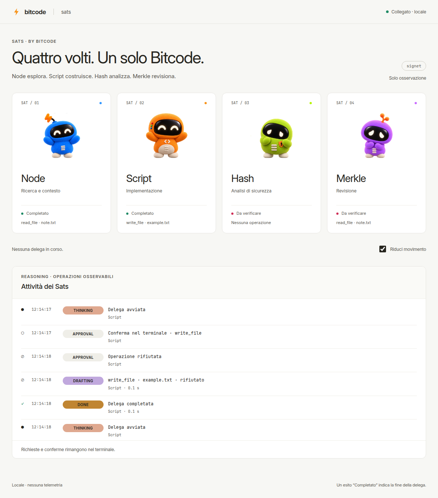
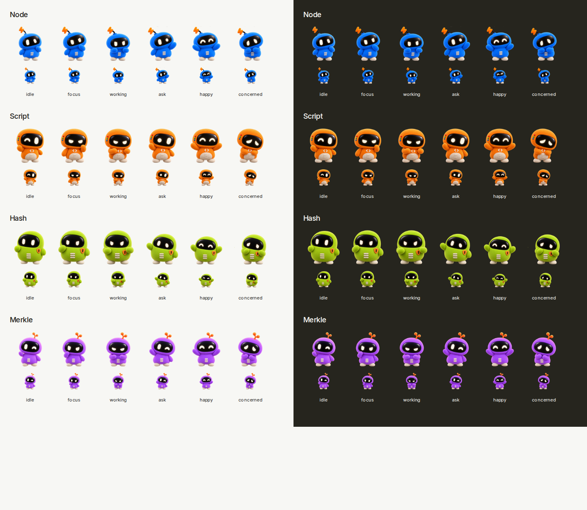

# Sats companion

The implemented scope is P0–P6 of the supplied plan: four personas, fixed tool
policies, a shared delegation runner, real runtime events and a local animated
observer. Browser task input, approvals and cancellation endpoints belong to P7
and are not installed or exposed in this release.

```sh
node bitcode.mjs --sats
# Open the printed http://127.0.0.1:<port>/#token=… URL.
# In the terminal:
/subagent
/subagent node investigate the architecture
/subagent script implement the requested change
```

Use the existing model/provider setup. `--sats` accepts only an interactive CLI
session; `--no-session` disables automatic transcript saving and conflicts with
resume. Selecting a card filters activity. The browser never starts tasks or
approves operations. No cloud server, bundler or new runtime dependency is needed.

## Personas and capability policies

Bundled Markdown is resolved relative to the package, independently of the user's
working directory. User Markdown in `$BITCODE_HOME/agents/` (default
`~/.bitcode/agents/`) overrides description/body. A missing bundled persona or
invalid manifest produces an actionable error. User overrides cannot change a
Sat's asset identity or its policy.

| Sat | Role | Exact tool allowlist |
| --- | --- | --- |
| Node | Research and context | `read_file`, `list_dir`, `btc_fees`, `btc_mempool`, `btc_tx`, `btc_address`, `btc_block`, `liquid_fees`, `liquid_mempool`, `liquid_tx`, `liquid_address`, `liquid_block`, `liquid_asset`, `ln_decode_invoice`, `ln_info`, `ln_balance`, `ln_channels`, `taproot_asset_balance` |
| Script | Implementation | `read_file`, `list_dir`, `write_file`, `edit_file`, `bash`, `ln_decode_invoice` |
| Hash | Security analysis | `read_file`, `list_dir`, `ln_decode_invoice` |
| Merkle | Review | `read_file`, `list_dir`, `ln_decode_invoice` |

The effective list intersects the available tool catalog. Bitcoin/Lightning
tools require the corresponding profile/configuration. Optional tools are not
invented when a node is absent. New tools never enter these lists implicitly.
Invoice creation is excluded explicitly despite its legacy non-mutating label.
Wallet, signing, payment, broadcast, arbitrary RPC and `subagent` are absent.
Script's approved shell commands can launch other programs: the allowlist is a
tool boundary, not a new OS sandbox. Existing workspace restrictions and permission
modes remain in effect.

Custom personas keep the existing generic tool policy minus recursive delegation.
They appear as `custom` plus their display name in activity, without a fifth mascot.
An unknown explicit name is an error. `/subagent -- <task>` selects the generic
runner deliberately.

Both `/subagent` and the model's `subagent` tool call `runSubagent()`, with fresh
messages and depth 1. An autonomous child returns only its final text to the parent;
its streaming output and tool trace are not injected into parent CLI output.
Approvals, cancellation, fallback targets, limits and the total tool-call counter
propagate to the child. Every internal mutation follows the parent's approval mode.
The observer bus allows one root run and one authorized child at a time.
Manual Sat commands start a root run for that Sat; a model-driven delegation
creates a child linked to the active Bitcode parent. Token usage callbacks from
autonomous children still feed the parent's usage accounting.

## Runtime contract

`runAgent()` continues to return text and use the existing provider/message
formats. Its optional `context` contains IDs, workspace, depth, signal and bus.
The optional third `onToolEnd` argument is `{outcome,text}`; legacy consumers still
receive their original result string. Control callbacks are separate from
observers. Throwing/rejecting observers are isolated; an approval callback failure
denies the operation. Pending terminal input is cleared on cancellation.

Events use `{v:1,seq,at,type,sessionId,runId,agentId,parentRunId?,toolCallId?,data}`.
Custom runs also have `displayName`. Event types are `run.started`, `model.started`,
`model.finished`, `tool.requested`, `approval.requested`, `approval.resolved`,
`tool.started`, `tool.finished`, `run.finished`. The resolved model is recorded
at run start. Requested/awaiting tools are distinct from execution, which starts
only after approval and mutation preparation. A run finishes exactly once.

Tool outcomes are `ok`, `error`, `denied`, `unknown_tool`, `cancelled`; final run
outcomes are `ok`, `error`, `max_steps`, `cancelled`. Exhausting the total tool
budget also produces an incomplete `max_steps` outcome. `ERROR` tool strings keep
their existing classification. A tool error/denial adds a warning and allows the
model to recover. Parallel reads maintain separate active tool state, so completing
one read does not clear another. Completion is not a correctness/security claim.

The feed projects only known public fields: names, normalized project-relative
paths (external files get a generic label), stage, outcome, duration and model ID.
Shell summaries contain no command. Prompts, model text, raw tool arguments/results,
credentials and error details remain outside the observer feed. All dynamic UI
text uses `textContent`.

The bus keeps 500 events, 100 activity entries and up to 40 completed/active run
records while retaining the latest built-in identities. No event log is written to
disk. The existing session subsystem owns transcripts. Resume restores messages;
old companion states are not reconstructed as active runs.

## HTTP boundary

| Route | Purpose |
| --- | --- |
| `GET /`, `/ui/*`, `/assets/sats/*` | Explicit allowlisted shell, scripts, fonts and images |
| `POST /api/attach` | Exchange a 256-bit in-memory fragment token for a cookie |
| `GET /api/bootstrap` | Authenticated registry, design tokens, network and snapshot |
| `GET /api/events` | Authenticated SSE with replay/snapshot recovery |

Binding is `127.0.0.1`, ephemeral port. Cookies are per-instance, HttpOnly,
SameSite=Strict and scoped to `/`. The loopback HTTP cookie deliberately has no
Secure attribute. The browser removes the fragment before attaching/bootstrap.
Host is exact, cross-origin/cross-site requests are rejected, attach requires an
exact Origin and JSON body limited to 4 KiB, and secret comparison uses
`timingSafeEqual`. Private API data requires the cookie. There is no open CORS.

Static paths are explicit and checked with `realpath` against their public
directory; traversal, encoded paths and symlink escapes are refused. CSP is
self-only with no objects, base URI or frames. Responses use no-store, nosniff and
no-referrer. Up to eight SSE clients receive sequence IDs and a 15-second heartbeat.
Reconnect uses Last-Event-ID; an out-of-buffer cursor receives a fresh snapshot.
Slow clients exceeding a 64 KiB write buffer disconnect without backpressuring
execution. Replayed/historical completion never retriggers celebration.

Closing a browser does not stop the CLI. `/exit`/EOF closes SSE and HTTP. Ctrl+C
during a task requests cancellation using the existing runtime; it does not undo
finished operations or guarantee termination of detached shell descendants.

## Visual assets

The panel follows Bitcode's cream canvas, warm Ink, white cards, hairline borders,
Inter and JetBrains Mono. Tokens and tool stages are shared with the ANSI theme.
Identity colors do not become action colors. Four columns become two below
1024px and one below 640px. Selection targets are at least 44px, focus is visible,
and state remains readable in text. The polite live region announces run start,
approval and completion rather than every tool event.

Every Sat has six transparent poses: `idle`, `focus`, `working`, `ask`, `happy`,
`concerned`. The manifest is the asset path source. Runtime images are 256px
lossless WebP with per-expression PNG fallback, plus a 96px head crop. Masters,
sources, 1280px cream/Ink brand cards and four 512px working GIFs are included in
the repository. GIFs are 48-frame, 3-second body loops; CSS drives stoppable UI
motion. Reduced motion, hidden tabs, offscreen cards and disconnected views stop
animation. Success has one brief live gesture followed by a static pose.

Assets were reused from the existing Sats implementation worktree, including its
original PNGs and identity-preserving expression atlases. Generation provenance
and prompts are in `assets/sats/sources/prompts.json`. Non-idle 1024px masters
are normalized/resampled from 512px atlas cells, not native 1024px renders.
The measured idle WebP total is 165,650 bytes; all poses total 977,926 bytes.
PNG fallbacks and licensed local fonts have separate sizes. Production npm
packaging excludes source atlases, masters, GIFs and brand cards.

## Verification and development

```sh
npm run check
# Optional development tools, never required for runtime:
npm install --no-save --package-lock=false playwright sharp
npx playwright install chromium
npm run test:browser
npm run test:package
# Rebuilding existing assets additionally requires ffmpeg:
npm run build:sats
```

`SATS_PLAYWRIGHT_MODULE`, `SATS_SHARP_MODULE` and `SATS_CHROMIUM_PATH` can select
existing local tooling. Browser screenshots and a structured check report are
written to ignored `artifacts/sats/`. `test:package` packs/extracts the actual npm
archive into a temporary directory and reuses the installed production
dependencies for a foreign-directory smoke; it needs `tar` (Linux/macOS).
Test providers/tools are deterministic
loopback fixtures; they never contact a paid model or funded node/wallet.

See [validation evidence and limits](sats-validation.md).




